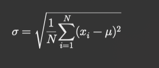

# Experiments output

Run `node ./task/index.js`

Full output of the experiments can be found in [this file](./outputs.md).

## Results

### Average execution time for Fibonacci sequence generation

| Experiment Size | JavaScript Time (ms) | Rust WASM Time (ms) | C++ WASM Time (ms) |
|-----------------|----------------------|---------------------|--------------------|
| 10 records      | 0.0646               | 0.0285              | 0.0293             |
| 20 records      | 0.1747               | 0.042               | 0.0459             |
| 40 records      | 937.448              | 357.1125            | 336.53875          |

### Average relative speedup of Rust and C++ WASM over JavaScript

| Experiment Size | JavaScript Time (%) | Rust WASM Time (%) | C++ WASM Time (%) |
|-----------------|---------------------|--------------------|-------------------|
| 10 records      | 100                 | 227                | 220               |
| 20 records      | 100                 | 416                | 380               |
| 40 records      | 100                 | 263                | 279               |

### Deviation analysis
Let's compute the Variation (Standard Deviation)

The standard deviation measures the amount of variation or dispersion of a set of values.

Standard Deviation Formula:

Where:
*   sigma  is the standard deviation.
*   N  is the number of data points. 
* x_i  is each individual data point. 
* mu  is the mean (average) of the data points.

| Experiment Size | Language   | Average Time (ms) | Std Dev (ms) | Range (ms) |
|-----------------|------------|-------------------|--------------|------------|
| 10 records      | JavaScript | 0.0646            | 0.0694       | 0.238      |
|                 | Rust       | 0.0285            | 0.0175       | 0.056      |
|                 | C/C++      | 0.0293            | 0.0182       | 0.061      |
| 20 records      | JavaScript | 0.1747            | 0.1172       | 0.313      |
|                 | Rust       | 0.0420            | 0.0104       | 0.028      |
|                 | C/C++      | 0.0459            | 0.0266       | 0.081      |
| 40 records      | JavaScript | 937.448           | 4.302        | 12.893     |
|                 | Rust       | 357.1125          | 2.272        | 7.169      |
|                 | C/C++      | 336.53875         | 6.153        | 20.252     |

**Let's analise this in terms of relative figures**

This table summarizes the standard deviation and range for each language and experiment size, both in absolute and relative figures.

| Experiment Size | Language   | Std Dev (ms) | Relative Std Dev (%) | Range (ms) | Relative Range (%) |
|-----------------|------------|--------------|----------------------|------------|--------------------|
| 10 records      | JavaScript | 0.0694       | 107.36               | 0.238      | 368.89             |
|                 | Rust       | 0.0175       | 61.40                | 0.056      | 196.49             |
|                 | C/C++      | 0.0182       | 62.12                | 0.061      | 208.87             |
| 20 records      | JavaScript | 0.1172       | 67.06                | 0.313      | 179.19             |
|                 | Rust       | 0.0104       | 24.76                | 0.028      | 66.67              |
|                 | C/C++      | 0.0266       | 57.95                | 0.081      | 176.25             |
| 40 records      | JavaScript | 4.302        | 0.46                 | 12.893     | 1.38               |
|                 | Rust       | 2.272        | 0.64                 | 7.169      | 2.01               |
|                 | C/C++      | 6.153        | 1.83                 | 20.252     | 6.02               |

## Conclusion:
1. Rust and C++ WASM implementations are significantly faster than JavaScript for all experiment sizes.
2. The difference is getting more significant in "mid-range" experiments (20 records).
3. The difference is less significant in "small" experiments (10 records).
4. The difference is also getting less significant in "large" experiments (40 records), considering that ~50 records lead to stackoverlfow errors. Here, the multiprocessing might be an option for further analysis.
5. The deviation analysis shows that Rust and C++ implementations are more stable than JavaScript, with a lower standard deviation and range, what can be very important in terms of predictability and reliability. Rust is the leader here.

## How the experiments were conducted:
- Each task was executed 5 times for each module written in different languages. Averages were taken.
- The experiment was repeated 2 times
- The experiment was conducted on a MacBook Pro 2023 Apple M3 Pro Processor with 18GB of RAM